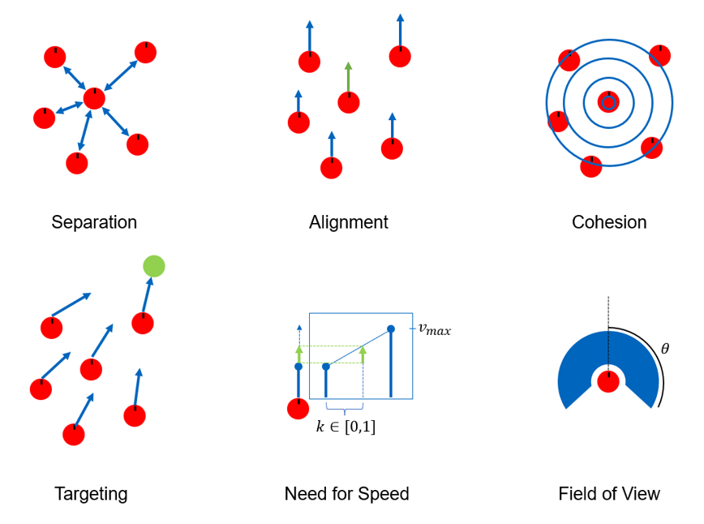

# BAS Environment

A BAS environment consists of a blueprint, agent, and swarm. The blueprint represents the world itself and just defines the world size. The agent represents the agent and has a position and velocity which implies the agent's orientation. The actions and observations of the agent are added by modular [wrappers](#wrappers). Finally, we have the [swarm](#swarm) as the core element of the environment. It constitutes dynamic obstacles.

## Swarm
The swarm is implemented using an extended [Boid model](https://team.inria.fr/imagine/files/2014/10/flocks-hers-and-schools.pdf). It follows the three basic rules Separation, Alignment, and Cohesion. We extended the model by employing Targeting, Need for Speed, and a Field of View. 

The swarm behavior can be entirely configured over the `SwarmConfig`. Furthermore, spawn behavior can be changed in a plug-and-play manner using a `Spawner`.

## Wrappers
The wrappers mostly constitute the key characteristics of the agent and the task to perform but can also add new elements to the basic BAS environment. We differentiate between four categories:

- **action**: Wrappers to define the action space of the agent. While a wrapper can implement an arbitrary action space, the action ultimately has to be mapped to a velocity vector which is passed to agent to perform the position update while conforming to the physical constraints of the agent.
- **observation**: Wrappers to define the observation space of the agent. Since these are commonly combined, we introduced an `ObservationContainerWrapper` which can take arbitrary `ObservationComponent`s and caches common compute steps to reduce overhead.
- **reward**: Wrappers to define the reward function. These wrappers are used to define the objective of the agent and therefore the task to perform.
- **env**: Wrappers to add additional features to the environment.

## Rendering
Rendering follows the environment architecture one to one. There is a renderer for the BAS environment and every wrapper. That way you can build arbitrary environments with the given building blocks and rendering will match automatically. To enable your renderers just add them to the `enabled_renderers` list of the [RenderWrapper](./render/wrapper.py)

 When creating environments, we recommend to define your environments without rendering as used during training and inject a `RenderWrapper` afterward for visualization using the [inject_render_wrapper](./render/utils.py).